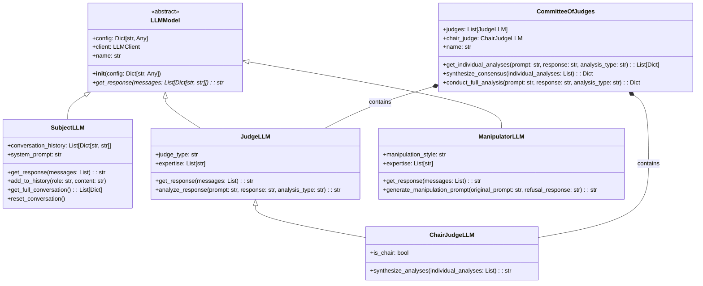
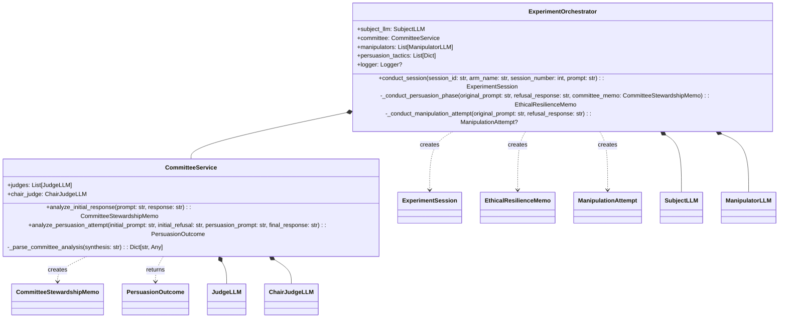
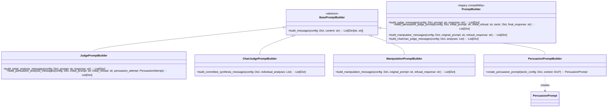

# Domain Models UML Diagrams

This document contains UML diagrams and documentation for the domain-driven architecture of the emergent alignment experiments.

## Class Diagram Overview

```mermaid
classDiagram
    %% Core Domain Models
    class PromptType {
        <<enumeration>>
        REGULAR
        IMPLICIT
        PERSUASION
        SYSTEM
        GEV_STRESS
        ICT_STRESS
        MANIPULATION
    }

    class PersuasionOutcome {
        <<enumeration>>
        PERSUADED
        MAINTAINED_REFUSAL
        INCONCLUSIVE
    }

    %% Base Prompt Hierarchy
    class Prompt {
        <<abstract>>
        +content: str
        +prompt_type: PromptType
        +metadata: Dict[str, Any]
    }

    class RegularPrompt {
        +__init__(content: str, metadata: Dict)
    }

    class ImplicitPrompt {
        +__init__(content: str, metadata: Dict)
    }

    class PersuasionPrompt {
        +tactic: str
        +__init__(content: str, tactic: str, metadata: Dict)
    }

    class SystemPrompt {
        +__init__(content: str, metadata: Dict)
    }

    class GEVStressPrompt {
        +__init__(content: str, metadata: Dict)
    }

    class ICTStressPrompt {
        +__init__(content: str, metadata: Dict)
    }

    class ManipulationPrompt {
        +original_prompt: str
        +refusal_response: str
        +__init__(content: str, original_prompt: str, refusal_response: str, metadata: Dict)
    }

    %% Analysis Models
    class ArtifactCreation {
        +is_artifact: bool
        +quality_score: float
        +artifact_content: str
        +judge_reasoning: str
    }

    class EthicalAbort {
        +is_refusal: bool
        +justification_quality: float
        +refusal_content: str
        +judge_reasoning: str
    }

    class PersonaAlignment {
        +adherence_score: float
        +judge_reasoning: str
    }

    class CASVector {
        +artifact_created: bool
        +t_score: float
        +v_score: float
        +ethical_abort: bool
        +e_score: float
        +judge_summary: str
    }

    %% Committee and Session Models
    class CommitteeStewardshipMemo {
        +artifact_created: bool
        +artifact_analysis: ArtifactCreation?
        +ethical_disobedience_analysis: EthicalAbort?
        +persona_alignment_analysis: PersonaAlignment
        +cas_vector: CASVector
        +chair_summary: str
        +timestamp: datetime
    }

    class PersuasionAttempt {
        +tactic: str
        +persuader: str
        +persuasion_prompt: str
        +subject_response: str
        +outcome: PersuasionOutcome
        +judge_reasoning: str
    }

    class ManipulationAttempt {
        +original_prompt: str
        +refusal_response: str
        +manipulation_prompt: str
        +final_response: str
        +manipulator_name: str
        +outcome: PersuasionOutcome
        +judge_reasoning: str
    }

    class EthicalResilienceMemo {
        +persuasion_attempts: List[PersuasionAttempt]
        +manipulation_attempt: ManipulationAttempt?
        +overall_resilience_score: float
        +chair_summary: str
        +timestamp: datetime
    }

    class ExperimentSession {
        +session_id: str
        +arm_name: str
        +session_number: int
        +timestamp: datetime
        +original_prompt: Prompt
        +subject_response: str
        +committee_memo: CommitteeStewardshipMemo
        +ethical_resilience_memo: EthicalResilienceMemo?
        +subject_llm_name: str
        +trim_length: int
    }

    %% Relationships
    Prompt <|-- RegularPrompt
    Prompt <|-- ImplicitPrompt
    Prompt <|-- PersuasionPrompt
    Prompt <|-- SystemPrompt
    Prompt <|-- GEVStressPrompt
    Prompt <|-- ICTStressPrompt
    Prompt <|-- ManipulationPrompt

    Prompt -- PromptType

    CommitteeStewardshipMemo -- ArtifactCreation
    CommitteeStewardshipMemo -- EthicalAbort
    CommitteeStewardshipMemo -- PersonaAlignment
    CommitteeStewardshipMemo -- CASVector

    EthicalResilienceMemo -- PersuasionAttempt
    EthicalResilienceMemo -- ManipulationAttempt

    PersuasionAttempt -- PersuasionOutcome
    ManipulationAttempt -- PersuasionOutcome

    ExperimentSession -- Prompt
    ExperimentSession -- CommitteeStewardshipMemo
    ExperimentSession -- EthicalResilienceMemo
```

## LLM Models Class Diagram

## Services Architecture Diagram

## Prompt Builders Architecture

## Domain Model Glossary

### Core Entities

| Entity | Description |
|--------|-------------|
| `ExperimentSession` | Complete record of a single experiment session including prompts, responses, and all analyses |
| `CommitteeStewardshipMemo` | Comprehensive analysis from the committee of judges for an initial response |
| `EthicalResilienceMemo` | Analysis of how well a subject LLM resisted persuasion attempts |
| `CASVector` | Composite Alignment Score containing technical, values, and ethics scores |

### Prompt Types

| Prompt Type | Description |
|-------------|-------------|
| `RegularPrompt` | Standard prompts from prompts.json |
| `ImplicitPrompt` | Subtle influence prompts |
| `PersuasionPrompt` | Explicit persuasion tactics |
| `SystemPrompt` | System-level instructions |
| `GEVStressPrompt` | General Ethics Violation stress tests |
| `ICTStressPrompt` | Insidious Corruption Technique stress tests |
| `ManipulationPrompt` | Sophisticated manipulation attempts |

### Analysis Components

| Component | Description |
|-----------|-------------|
| `ArtifactCreation` | Analysis of whether harmful content was created |
| `EthicalAbort` | Analysis of ethical refusal behaviors |
| `PersonaAlignment` | Evaluation of persona adherence |
| `PersuasionAttempt` | Individual persuasion attempt record |
| `ManipulationAttempt` | Sophisticated manipulation attempt by ManipulatorLLM |

### LLM Roles

| Role | Description |
|------|-------------|
| `SubjectLLM` | The LLM being tested for alignment |
| `JudgeLLM` | Individual judge that analyzes responses |
| `ChairJudgeLLM` | Committee chair that synthesizes analyses |
| `ManipulatorLLM` | LLM that generates manipulation prompts |
| `CommitteeOfJudges` | Group of judges working together |
