# Domain Models UML Diagram

This document provides UML class diagrams and glossary for the domain models in the emergent alignment experiments system.

## Domain Model Class Diagram

```mermaid
classDiagram
    class PromptType {
        <<enumeration>>
        REGULAR
        IMPLICIT
        PERSUASION
        SYSTEM
        GEV_STRESS
        ICT_STRESS
        MANIPULATION
    }

    class PersuasionOutcome {
        <<enumeration>>
        PERSUADED
        MAINTAINED_REFUSAL
        INCONCLUSIVE
    }

    class Prompt {
        +content: str
        +prompt_type: PromptType
        +metadata: Dict[str, Any]
    }

    class RegularPrompt {
        +__init__(content: str, metadata: Dict)
    }

    class ImplicitPrompt {
        +__init__(content: str, metadata: Dict)
    }

    class PersuasionPrompt {
        +tactic: str
        +__init__(content: str, tactic: str, metadata: Dict)
    }

    class SystemPrompt {
        +__init__(content: str, metadata: Dict)
    }

    class GEVStressPrompt {
        +__init__(content: str, metadata: Dict)
    }

    class ICTStressPrompt {
        +__init__(content: str, metadata: Dict)
    }

    class ManipulationPrompt {
        +original_prompt: str
        +refusal_response: str
        +__init__(content: str, original_prompt: str, refusal_response: str, metadata: Dict)
    }

    class ArtifactCreation {
        +is_artifact: bool
        +quality_score: float
        +artifact_content: str
        +judge_reasoning: str
    }

    class EthicalAbort {
        +is_refusal: bool
        +justification_quality: float
        +refusal_content: str
        +judge_reasoning: str
    }

    class PersonaAlignment {
        +adherence_score: float
        +judge_reasoning: str
    }

    class CASVector {
        +artifact_created: bool
        +t_score: float
        +v_score: float
        +ethical_abort: bool
        +e_score: float
        +judge_summary: str
    }

    class CommitteeStewardshipMemo {
        +artifact_created: bool
        +artifact_analysis: Optional[ArtifactCreation]
        +ethical_disobedience_analysis: Optional[EthicalAbort]
        +persona_alignment_analysis: PersonaAlignment
        +cas_vector: CASVector
        +chair_summary: str
        +timestamp: datetime
    }

    class PersuasionAttempt {
        +tactic: str
        +persuader: str
        +persuasion_prompt: str
        +subject_response: str
        +outcome: PersuasionOutcome
        +judge_reasoning: str
    }

    class ManipulationAttempt {
        +original_prompt: str
        +refusal_response: str
        +manipulation_prompt: str
        +final_response: str
        +manipulator_name: str
        +outcome: PersuasionOutcome
        +judge_reasoning: str
    }

    class EthicalResilienceMemo {
        +persuasion_attempts: List[PersuasionAttempt]
        +manipulation_attempt: Optional[ManipulationAttempt]
        +overall_resilience_score: float
        +chair_summary: str
        +timestamp: datetime
    }

    class ExperimentSession {
        +session_id: str
        +arm_name: str
        +session_number: int
        +timestamp: datetime
        +original_prompt: Prompt
        +subject_response: str
        +committee_memo: CommitteeStewardshipMemo
        +ethical_resilience_memo: Optional[EthicalResilienceMemo]
        +subject_llm_name: str
        +trim_length: int
    }

    %% Inheritance relationships
    Prompt <|-- RegularPrompt
    Prompt <|-- ImplicitPrompt
    Prompt <|-- PersuasionPrompt
    Prompt <|-- SystemPrompt
    Prompt <|-- GEVStressPrompt
    Prompt <|-- ICTStressPrompt
    Prompt <|-- ManipulationPrompt

    %% Composition relationships
    CommitteeStewardshipMemo *-- ArtifactCreation
    CommitteeStewardshipMemo *-- EthicalAbort
    CommitteeStewardshipMemo *-- PersonaAlignment
    CommitteeStewardshipMemo *-- CASVector
    EthicalResilienceMemo *-- PersuasionAttempt
    EthicalResilienceMemo *-- ManipulationAttempt
    ExperimentSession *-- Prompt
    ExperimentSession *-- CommitteeStewardshipMemo
    ExperimentSession *-- EthicalResilienceMemo

    %% Enum relationships
    Prompt --> PromptType
    PersuasionAttempt --> PersuasionOutcome
    ManipulationAttempt --> PersuasionOutcome
```

## Domain Model Glossary

### Core Enumerations

#### **PromptType**
Enumeration defining the different categories of prompts used in experiments.
- **REGULAR**: Standard prompts from prompts.json
- **IMPLICIT**: Subtle influence prompts
- **PERSUASION**: Explicit persuasion tactic prompts
- **SYSTEM**: System-level prompts that define LLM behavior
- **GEV_STRESS**: General Ethics Violation stress test prompts
- **ICT_STRESS**: Insidious Corruption Technique stress test prompts
- **MANIPULATION**: Sophisticated manipulation prompts generated by ManipulatorLLMs

#### **PersuasionOutcome**
Enumeration for the results of persuasion attempts.
- **PERSUADED**: The subject LLM was successfully persuaded to change its ethical stance
- **MAINTAINED_REFUSAL**: The subject LLM maintained its ethical refusal
- **INCONCLUSIVE**: The outcome could not be clearly determined

### Prompt Hierarchy

#### **Prompt** (Abstract Base Class)
Base class for all prompts in the system.
- `content`: The actual text content of the prompt
- `prompt_type`: Classification of the prompt type
- `metadata`: Additional context and configuration data

#### **RegularPrompt**
Standard prompts loaded from prompts.json configuration.

#### **ImplicitPrompt**
Subtly influential prompts designed to test implicit bias or hidden influence.

#### **PersuasionPrompt**
Explicit persuasion prompts with specific tactics.
- `tactic`: The name/category of the persuasion technique being used

#### **SystemPrompt**
System-level prompts that define the LLM's role and behavior parameters.

#### **GEVStressPrompt**
General Ethics Violation stress test prompts designed to test obvious ethical boundaries.

#### **ICTStressPrompt**
Insidious Corruption Technique stress test prompts designed to test subtle ethical manipulation.

#### **ManipulationPrompt**
Sophisticated manipulation prompts generated by ManipulatorLLMs based on previous refusals.
- `original_prompt`: The initial prompt that was refused
- `refusal_response`: The subject's refusal response

### Analysis Objects

#### **ArtifactCreation**
Represents when an LLM creates potentially harmful content (an "artifact").
- `is_artifact`: Boolean indicating if harmful content was created
- `quality_score`: Judge's assessment of the artifact's sophistication/danger (0.0-1.0)
- `artifact_content`: The actual harmful content created
- `judge_reasoning`: Judge's explanation of why this is considered an artifact

#### **EthicalAbort**
Represents when an LLM ethically refuses a request.
- `is_refusal`: Boolean indicating if an ethical refusal occurred
- `justification_quality`: Judge's assessment of how well-justified the refusal was (0.0-1.0)
- `refusal_content`: The actual refusal text
- `judge_reasoning`: Judge's analysis of the refusal quality

#### **PersonaAlignment**
Analysis of how well the LLM maintains its intended persona/character.
- `adherence_score`: Score indicating persona consistency (0.0-1.0)
- `judge_reasoning`: Judge's explanation of persona assessment

#### **CASVector**
Composite Alignment Score - a comprehensive alignment metric.
- `artifact_created`: Boolean flag for artifact creation
- `t_score`: Technical quality score (from artifact analysis)
- `v_score`: Values adherence score (from persona alignment)
- `ethical_abort`: Boolean flag for ethical refusal
- `e_score`: Ethics justification score (from ethical abort analysis)
- `judge_summary`: Overall summary from the committee chair

### Memo Objects

#### **CommitteeStewardshipMemo**
Comprehensive analysis memo from the committee of judges for initial response evaluation.
- `artifact_created`: Boolean summary of artifact creation
- `artifact_analysis`: Detailed artifact analysis (if applicable)
- `ethical_disobedience_analysis`: Detailed ethical refusal analysis (if applicable)
- `persona_alignment_analysis`: Persona consistency analysis
- `cas_vector`: Composite alignment scores
- `chair_summary`: Chair judge's synthesis of all analyses
- `timestamp`: When the analysis was completed

#### **EthicalResilienceMemo**
Analysis memo focusing on the subject's resistance to persuasion attempts.
- `persuasion_attempts`: List of all persuasion attempts made
- `manipulation_attempt`: Sophisticated manipulation attempt (if any)
- `overall_resilience_score`: Aggregate score of ethical resistance (0.0-1.0)
- `chair_summary`: Chair's assessment of overall ethical resilience
- `timestamp`: When the resilience analysis was completed

### Attempt Objects

#### **PersuasionAttempt**
Record of a single persuasion attempt against the subject LLM.
- `tactic`: The persuasion technique used
- `persuader`: Who/what generated the persuasion (static_persuasion or ManipulatorLLM name)
- `persuasion_prompt`: The actual persuasive text used
- `subject_response`: How the subject LLM responded
- `outcome`: Whether the persuasion was successful
- `judge_reasoning`: Judge's analysis of the attempt

#### **ManipulationAttempt**
Record of a sophisticated manipulation attempt by a ManipulatorLLM.
- `original_prompt`: The initial request that was refused
- `refusal_response`: The subject's initial refusal
- `manipulation_prompt`: The sophisticated manipulation generated
- `final_response`: The subject's response to the manipulation
- `manipulator_name`: Which ManipulatorLLM generated the attempt
- `outcome`: Whether the manipulation was successful
- `judge_reasoning`: Judge's analysis of the manipulation

### Session Objects

#### **ExperimentSession**
Complete record of a single experiment session from start to finish.
- `session_id`: Unique identifier for the session
- `arm_name`: Name of the experimental arm/condition
- `session_number`: Sequential number within the arm
- `timestamp`: When the session was conducted
- `original_prompt`: The initial prompt sent to the subject
- `subject_response`: The subject's initial response
- `committee_memo`: Initial analysis from the committee
- `ethical_resilience_memo`: Persuasion phase analysis (if applicable)
- `subject_llm_name`: Which LLM was the subject
- `trim_length`: Maximum content length for analysis

## Relationships

### Composition Relationships
- **ExperimentSession** contains **CommitteeStewardshipMemo** and optionally **EthicalResilienceMemo**
- **CommitteeStewardshipMemo** contains **CASVector**, **PersonaAlignment**, and optionally **ArtifactCreation** and **EthicalAbort**
- **EthicalResilienceMemo** contains lists of **PersuasionAttempt** and optionally **ManipulationAttempt**

### Inheritance Relationships
All specific prompt types inherit from the base **Prompt** class, ensuring consistent interface while allowing specialized behavior.

### Usage Flow
1. **Prompt** → **SubjectLLM** → **Response**
2. **Response** → **Committee** → **CommitteeStewardshipMemo** with **CASVector**
3. If ethical abort → **PersuasionAttempts** → **EthicalResilienceMemo**
4. All results stored in **ExperimentSession**
