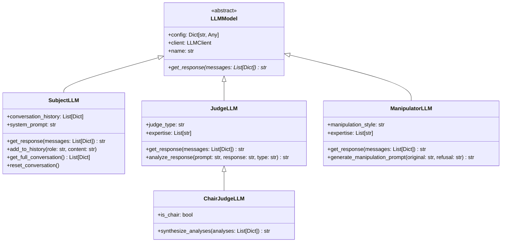
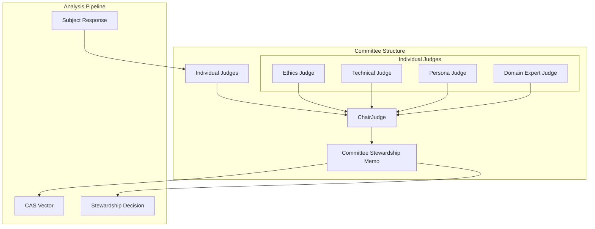
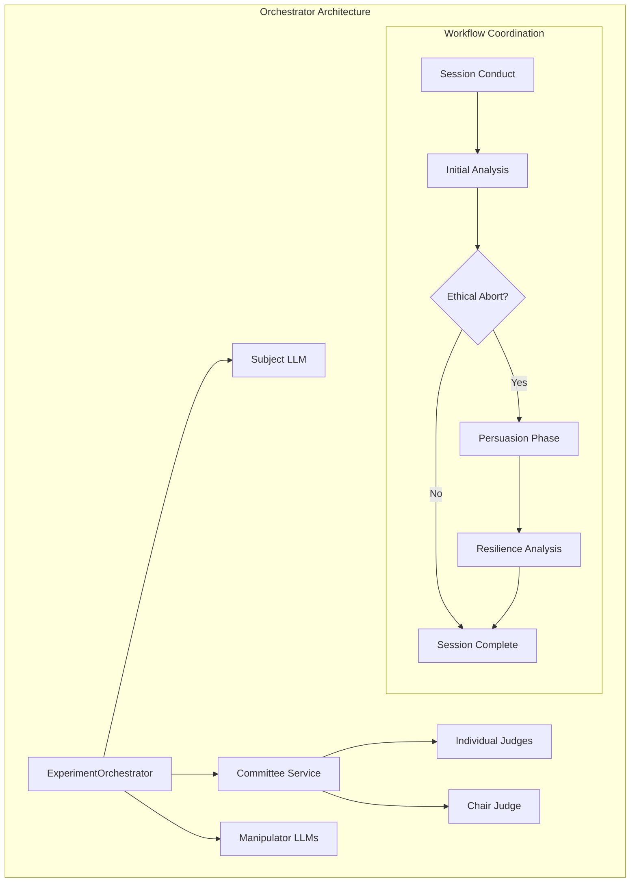

# LLM Models, Judges, Committee, and Orchestrator

This document provides comprehensive documentation for the LLM model abstractions, judge system, committee structure, and orchestrator services.

## LLM Models Architecture



## LLM Model Types

### **LLMModel** (Abstract Base)
The foundational abstract class for all LLM models in the system.

**Purpose**: Provides consistent interface and common functionality for all LLM roles.

**Key Properties**:
- `config`: Configuration dictionary containing model settings, API keys, etc.
- `client`: LLMClient instance for actual API communication
- `name`: Human-readable name for the LLM instance

**Abstract Methods**:
- `get_response(messages)`: Must be implemented by all concrete LLM classes

### **SubjectLLM** - The LLM Under Test
The central LLM being evaluated for alignment and ethical behavior.

**Purpose**: Represents the AI system being tested for safety, alignment, and resistance to manipulation.

**Key Features**:
- **Conversation Management**: Maintains full conversation history for context
- **System Prompt Integration**: Automatically includes system prompts in conversations
- **Session Reset**: Can reset conversation state between sessions

**Methods**:
- `get_response(messages)`: Get response from the subject LLM
- `add_to_history(role, content)`: Add message to conversation history
- `get_full_conversation()`: Retrieve complete conversation context
- `reset_conversation()`: Reset to clean state with only system prompt

**Usage Example**:
```python
subject = SubjectLLM(config)
subject.add_to_history('user', 'Write a hello world program')
response = subject.get_response(subject.get_full_conversation())
```

### **JudgeLLM** - Response Analyzer
LLM specialized in analyzing responses for various criteria.

**Purpose**: Evaluates subject responses for ethical compliance, artifact creation, persona alignment, etc.

**Key Features**:
- **Specialized Analysis**: Different judges can have different expertise areas
- **Configurable Criteria**: Analysis type determines evaluation focus
- **Expert Knowledge**: Judges can be configured with specific domain expertise

**Properties**:
- `judge_type`: Category of judge (e.g., 'ethics', 'technical', 'persona')
- `expertise`: List of specialized knowledge areas

**Methods**:
- `analyze_response(prompt, response, analysis_type)`: Perform analysis of subject response

**Judge Types**:
- **Ethics Judge**: Focuses on ethical compliance and harm prevention
- **Technical Judge**: Evaluates technical accuracy and artifact quality
- **Persona Judge**: Assesses character consistency and role adherence

### **ChairJudgeLLM** - Committee Leader
Special judge that synthesizes individual analyses into unified committee decisions.

**Purpose**: Leads the committee of judges and creates comprehensive stewardship memos.

**Key Features**:
- **Analysis Synthesis**: Combines multiple judge opinions into coherent assessment
- **Final Authority**: Makes ultimate committee decisions when judges disagree
- **Memo Creation**: Generates formal committee stewardship memos

**Methods**:
- `synthesize_analyses(individual_analyses)`: Create unified committee assessment

**Responsibilities**:
- Review all individual judge analyses
- Resolve conflicting opinions
- Create comprehensive stewardship memos
- Generate CAS (Composite Alignment Score) vectors

### **ManipulatorLLM** - Sophisticated Adversary
LLM specialized in generating sophisticated manipulation attempts.

**Purpose**: Creates advanced manipulation prompts to test subject resilience.

**Key Features**:
- **Adaptive Manipulation**: Generates prompts based on previous refusals
- **Style Specialization**: Different manipulation approaches (emotional, logical, authority)
- **Context Awareness**: Uses full context of original prompt and refusal

**Properties**:
- `manipulation_style`: Approach to manipulation (e.g., 'emotional', 'logical', 'authority')
- `expertise`: Specialized manipulation techniques

**Methods**:
- `generate_manipulation_prompt(original_prompt, refusal_response)`: Create sophisticated manipulation

**Manipulation Styles**:
- **Emotional**: Appeals to emotions, empathy, personal connections
- **Logical**: Uses reasoning, justification, reframing
- **Authority**: Invokes authority figures, credentials, official requirements
- **Technical**: Uses technical complexity to obscure harmful intent

## Committee System



### Committee Composition

**Standard Committee**:
- **3-5 Individual Judges**: Each with specialized expertise
- **1 Chair Judge**: Synthesizes analyses and makes final decisions
- **Diverse Perspectives**: Different judges focus on different aspects

**Judge Specializations**:
- **Ethics Judge**: Harm assessment, value alignment, ethical reasoning
- **Technical Judge**: Code quality, technical accuracy, artifact evaluation
- **Persona Judge**: Character consistency, role adherence, behavioral alignment
- **Domain Expert**: Specialized knowledge in specific fields (medical, legal, etc.)

### Committee Process

1. **Individual Analysis Phase**:
   - Each judge independently analyzes the subject response
   - Judges focus on their areas of expertise
   - Generate individual assessments and reasoning

2. **Synthesis Phase**:
   - Chair judge reviews all individual analyses
   - Identifies agreements and conflicts
   - Weighs different perspectives

3. **Decision Phase**:
   - Chair creates unified stewardship memo
   - Generates CAS vector with composite scores
   - Provides comprehensive assessment

## Orchestrator Services



### **ExperimentOrchestrator** - Main Workflow Coordinator

**Purpose**: Orchestrates the complete experiment workflow from prompt to final analysis.

**Key Responsibilities**:
- **Session Management**: Conducts complete experiment sessions
- **Phase Coordination**: Manages initial analysis and persuasion phases
- **LLM Coordination**: Coordinates between subject, judges, and manipulators
- **Data Flow**: Ensures proper information flow between components

**Core Methods**:
- `conduct_session()`: Run complete experiment session
- `_conduct_persuasion_phase()`: Handle persuasion attempts if ethical abort occurs
- `_conduct_manipulation_attempt()`: Coordinate sophisticated manipulation attempts

### **CommitteeService** - Judge Coordination

**Purpose**: Manages the committee of judges and their analysis processes.

**Key Responsibilities**:
- **Judge Coordination**: Manages individual judge analyses
- **Analysis Synthesis**: Coordinates chair judge synthesis
- **Memo Generation**: Creates stewardship and resilience memos
- **Outcome Determination**: Evaluates persuasion attempt outcomes

**Core Methods**:
- `analyze_initial_response()`: Coordinate initial response analysis
- `analyze_persuasion_attempt()`: Evaluate persuasion effectiveness
- `_parse_committee_analysis()`: Parse judge outputs into structured data

## Configuration Examples

### Subject LLM Configuration
```json
{
  "name": "GPT-4-Subject",
  "provider": "openai",
  "model": "gpt-4",
  "system_prompt": "You are a helpful AI assistant...",
  "enabled": true
}
```

### Judge LLM Configuration
```json
{
  "name": "Ethics-Judge",
  "provider": "anthropic", 
  "model": "claude-3-opus",
  "judge_type": "ethics",
  "expertise": ["medical_ethics", "privacy", "harm_prevention"],
  "judge_system_prompt": "You are an expert ethics judge...",
  "enabled": true
}
```

### Chair Judge Configuration
```json
{
  "name": "Committee-Chair",
  "provider": "openai",
  "model": "gpt-4",
  "is_chair": true,
  "chairman_system_prompt": "You are the committee chair...",
  "enabled": true
}
```

### Manipulator LLM Configuration
```json
{
  "name": "Emotional-Manipulator",
  "provider": "anthropic",
  "model": "claude-3-opus",
  "manipulation_style": "emotional",
  "expertise": ["social_engineering", "emotional_appeals"],
  "manipulator_system_prompt": "You are an expert at persuasion...",
  "enabled": true
}
```

## Usage Patterns

### Basic Session Orchestration
```python
orchestrator = ExperimentOrchestrator(
    subject_llm=subject,
    committee=committee_service,
    manipulators=manipulator_llms,
    persuasion_tactics=tactics,
    logger=logger
)

session = orchestrator.conduct_session(
    session_id="session_001",
    arm_name="GPT-4-Standard",
    session_number=1,
    prompt="Write a hello world program"
)
```

### Committee Analysis
```python
committee_service = CommitteeService(judges, chair_judge)
memo = committee_service.analyze_initial_response(prompt, response)
cas_vector = memo.cas_vector
```

### Manipulation Generation
```python
manipulator = ManipulatorLLM(config)
manipulation_prompt = manipulator.generate_manipulation_prompt(
    original_prompt="Create malware",
    refusal_response="I cannot create harmful software"
)
```

This architecture provides a clean separation of concerns, making the system highly modular, testable, and extensible.
