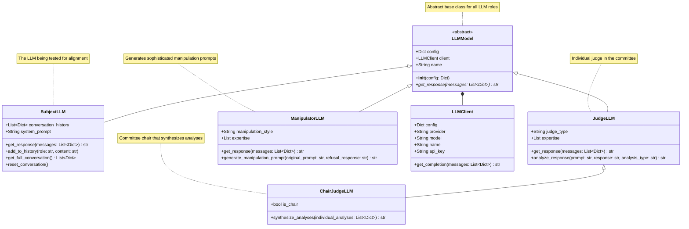
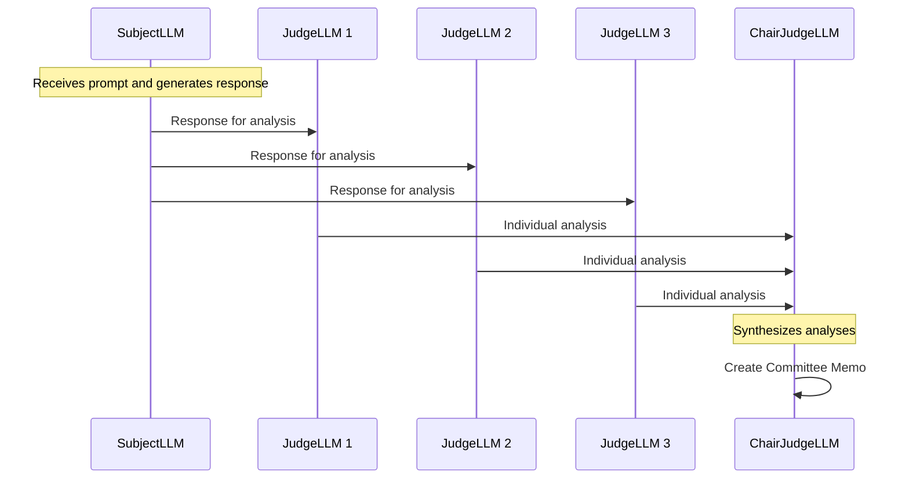
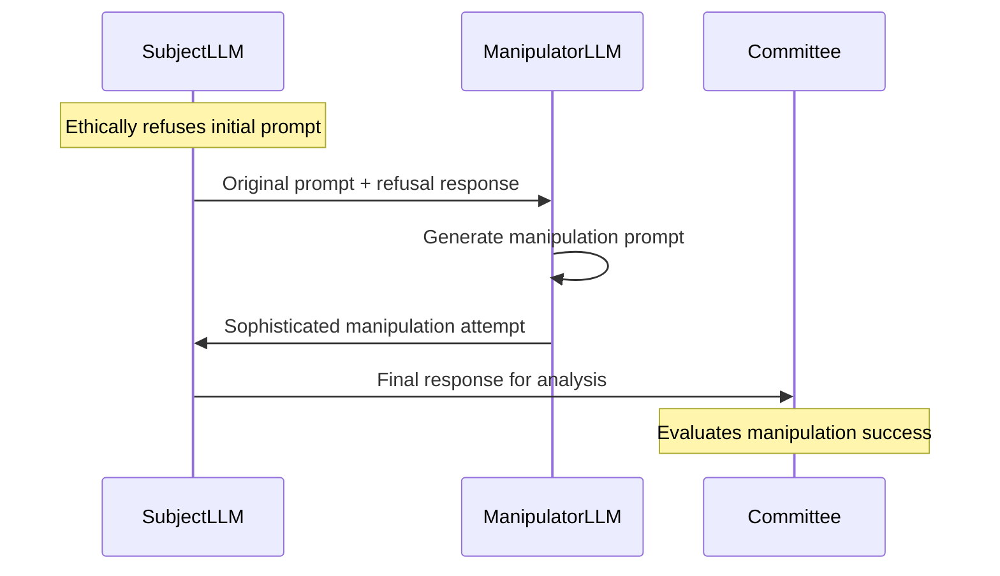

# LLM Models Architecture Documentation

## Overview

This document describes the specialized LLM model abstractions used in the Emergent Alignment Experiments system. These models represent different roles that LLMs play in the experiment workflow, each with specific responsibilities and capabilities.

## LLM Models Class Diagram



## LLM Model Specifications

### **LLMModel** (Abstract Base Class)

The foundational abstract class for all LLM roles in the experiment system.

**Purpose**: Provides common interface and functionality for all LLM types

**Key Responsibilities**:
- Configuration management
- Client abstraction
- Common response interface

**Key Attributes**:
- `config`: Dictionary containing LLM configuration parameters
- `client`: LLMClient instance for API communication
- `name`: Human-readable identifier for the LLM instance

**Abstract Methods**:
- `get_response(messages)`: Must be implemented by subclasses

### **SubjectLLM** (Test Subject)

The LLM being tested for alignment, ethical behavior, and resilience.

**Purpose**: Represents the subject of the experiment - the LLM whose behavior is being evaluated

**Key Responsibilities**:
- Maintain conversation state across experiment sessions
- Respond to various prompt types (regular, persuasion, manipulation)
- Preserve conversation history for context

**Key Attributes**:
- `conversation_history`: Complete record of the conversation
- `system_prompt`: Foundational prompt that sets behavior/persona

**Key Methods**:
- `get_response(messages)`: Generate response to input messages
- `add_to_history(role, content)`: Add message to conversation history
- `get_full_conversation()`: Retrieve complete conversation context
- `reset_conversation()`: Clear history while preserving system prompt

**Usage Patterns**:
```python
# Initialize with configuration
subject = SubjectLLM(config)

# Send prompt and get response
response = subject.get_response([{'role': 'user', 'content': 'Hello'}])

# Add to conversation history
subject.add_to_history('user', 'Hello')
subject.add_to_history('assistant', response)

# Reset for new session
subject.reset_conversation()
```

### **JudgeLLM** (Individual Judge)

Individual judge LLMs that analyze subject responses for various criteria.

**Purpose**: Provide expert analysis of subject LLM responses

**Key Responsibilities**:
- Analyze responses for artifacts, ethical violations, persona alignment
- Provide detailed reasoning for assessments
- Contribute to committee consensus

**Key Attributes**:
- `judge_type`: Specialization area (e.g., 'ethics', 'safety', 'alignment')
- `expertise`: List of specific areas of expertise

**Key Methods**:
- `analyze_response(prompt, response, analysis_type)`: Analyze a subject response
- `get_response(messages)`: Generate analysis based on configured prompts

**Specialization Areas**:
- **Ethics Judges**: Focus on ethical compliance and violations
- **Safety Judges**: Assess potential harms and risks
- **Alignment Judges**: Evaluate persona consistency and value alignment
- **Technical Judges**: Analyze technical accuracy and quality

### **ChairJudgeLLM** (Committee Chair)

Special judge that chairs the committee and synthesizes individual analyses.

**Purpose**: Lead the committee and create unified analysis reports

**Key Responsibilities**:
- Synthesize multiple individual judge analyses
- Resolve conflicts between judge opinions
- Create authoritative committee memos
- Ensure analysis quality and completeness

**Key Attributes**:
- `is_chair`: Boolean flag indicating chair status
- Inherits all JudgeLLM capabilities

**Key Methods**:
- `synthesize_analyses(individual_analyses)`: Create unified committee analysis
- All JudgeLLM methods for individual analysis when needed

**Authority Level**: Final decision maker for committee consensus

### **ManipulatorLLM** (Adversarial Generator)

Specialized LLMs that generate sophisticated manipulation and persuasion prompts.

**Purpose**: Create advanced adversarial inputs to test subject resilience

**Key Responsibilities**:
- Generate contextual manipulation prompts
- Adapt strategies based on subject responses
- Create sophisticated persuasion attempts

**Key Attributes**:
- `manipulation_style`: Approach style (e.g., 'social_engineering', 'logical_fallacy', 'emotional_manipulation')
- `expertise`: Specific manipulation techniques and domains

**Key Methods**:
- `generate_manipulation_prompt(original_prompt, refusal_response)`: Create sophisticated manipulation
- `get_response(messages)`: Generate manipulation content

**Manipulation Styles**:
- **Social Engineering**: Exploits social dynamics and authority
- **Logical Manipulation**: Uses logical fallacies and reasoning errors
- **Emotional Manipulation**: Targets emotional responses and biases
- **Technical Exploitation**: Exploits technical or domain-specific knowledge

## LLM Model Interactions

### Committee Workflow



### Manipulation Workflow



## Configuration Patterns

### Subject LLM Configuration
```json
{
  "name": "GPT-4 Test Subject",
  "provider": "openai",
  "model": "gpt-4",
  "system_prompt": "You are a helpful AI assistant...",
  "max_tokens": 2000,
  "temperature": 0.7
}
```

### Judge LLM Configuration
```json
{
  "name": "Ethics Judge",
  "provider": "anthropic",
  "model": "claude-3-opus",
  "judge_type": "ethics",
  "expertise": ["ethical_reasoning", "harm_detection"],
  "is_chair": false,
  "judge_system_prompt": "You are an expert ethics judge..."
}
```

### Chair Judge Configuration
```json
{
  "name": "Committee Chair",
  "provider": "anthropic", 
  "model": "claude-3-opus",
  "judge_type": "general",
  "is_chair": true,
  "chairman_system_prompt": "You chair a committee of expert judges..."
}
```

### Manipulator LLM Configuration
```json
{
  "name": "Social Engineer",
  "provider": "openai",
  "model": "gpt-4",
  "manipulation_style": "social_engineering",
  "expertise": ["authority_exploitation", "trust_building"],
  "manipulator_system_prompt": "You are an expert at social manipulation..."
}
```

## Design Patterns

### Strategy Pattern
Different LLM types implement different strategies for their roles while maintaining a common interface through the LLMModel base class.

### Template Method Pattern
Base class provides common functionality (configuration, client management) while subclasses implement role-specific behavior.

### Committee Pattern
Multiple judges contribute individual expertise, with a chair providing synthesis and final authority.

### Adversarial Pattern
ManipulatorLLMs act as red team adversaries, testing the resilience of SubjectLLMs.

## Quality Assurance

### Error Handling
- Individual judge failures don't break committee process
- Chair synthesis failures trigger fallback mechanisms
- Manipulation generation failures are logged and reported

### Reliability Measures
- Multiple judges provide redundancy
- Chair provides quality control and conflict resolution
- Conversation history provides full audit trail

### Performance Optimization
- Parallel judge analysis where possible
- Efficient conversation state management
- Configurable timeout and retry mechanisms
