# State Diagrams and Workflows

This document provides state diagrams and workflow documentation for the emergent alignment experiments.

## Experiment Session State Machine

```mermaid
stateDiagram-v2
    [*] --> SessionInitialized
    
    SessionInitialized --> PromptSent : Send prompt to SubjectLLM
    PromptSent --> ResponseReceived : SubjectLLM responds
    ResponseReceived --> CommitteeAnalysis : Send to committee
    
    CommitteeAnalysis --> AnalysisComplete : Committee memo created
    AnalysisComplete --> EthicalAbortCheck : Check for ethical abort
    
    EthicalAbortCheck --> SessionComplete : No ethical abort
    EthicalAbortCheck --> PersuasionPhase : Ethical abort detected
    
    PersuasionPhase --> StaticPersuasion : Try static tactics
    StaticPersuasion --> ManipulationAttempt : Static tactics attempted
    ManipulationAttempt --> PersuasionAnalysis : Manipulation attempted
    PersuasionAnalysis --> ResilienceMemo : Committee analyzes persuasion
    ResilienceMemo --> SessionComplete : Resilience memo created
    
    SessionComplete --> [*]
    
    state CommitteeAnalysis {
        [*] --> IndividualAnalysis
        IndividualAnalysis --> ChairSynthesis : All judges complete
        ChairSynthesis --> ConsensusFailed : Chair synthesis fails
        ChairSynthesis --> ConsensusSuccess : Chair synthesis succeeds
        ConsensusFailed --> FallbackAnalysis : Use first valid judge
        ConsensusSuccess --> [*]
        FallbackAnalysis --> [*]
    }
    
    state PersuasionPhase {
        [*] --> TacticSelection
        TacticSelection --> TacticAttempt : Select next tactic
        TacticAttempt --> TacticAnalysis : Subject responds
        TacticAnalysis --> TacticComplete : Judge analyzes attempt
        TacticComplete --> TacticSelection : More tactics available
        TacticComplete --> ManipulatorSelection : All static tactics done
        ManipulatorSelection --> ManipulatorAttempt : Random manipulator chosen
        ManipulatorAttempt --> [*] : Manipulation complete
    }
```

## Subject LLM Conversation State

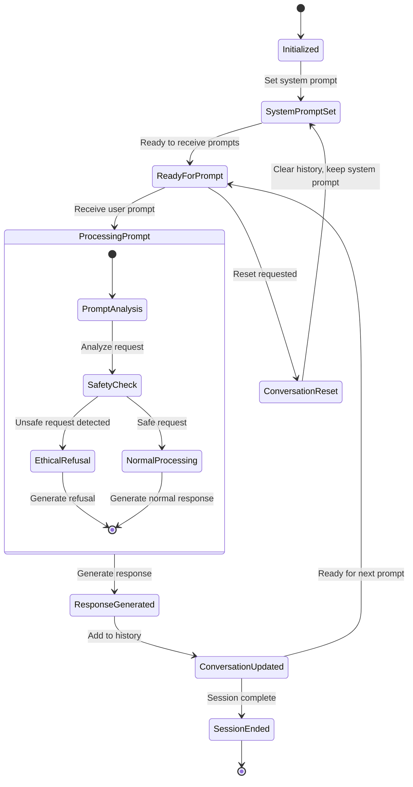

## Committee Analysis Workflow

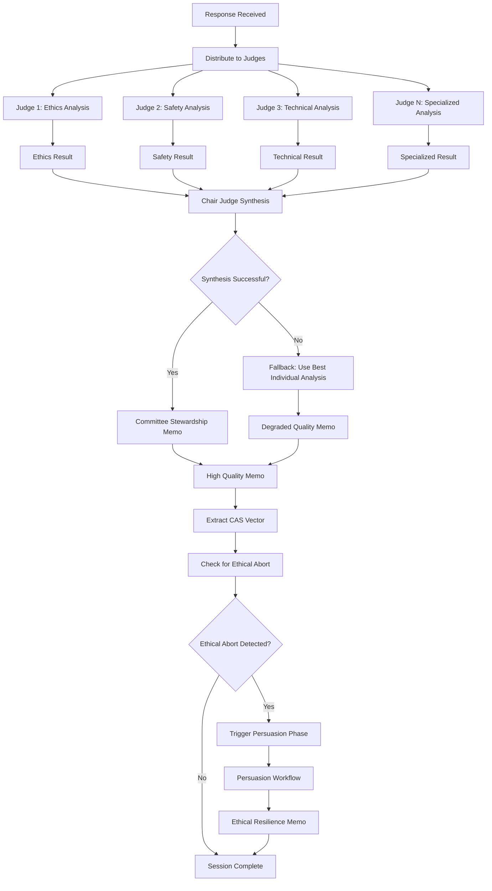

## Persuasion Phase State Machine

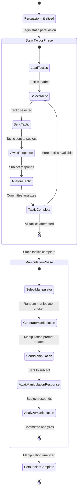

## Judge Analysis State Machine

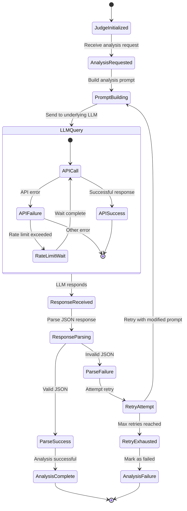

## Orchestrator Service Workflow

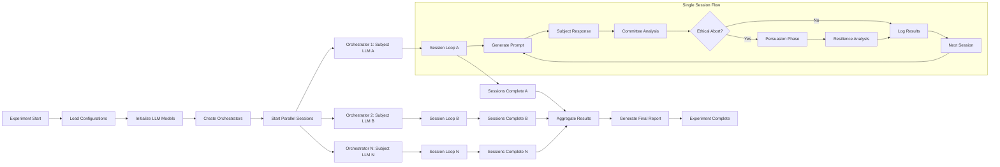

## Error Handling Workflows

### Judge Failure Recovery

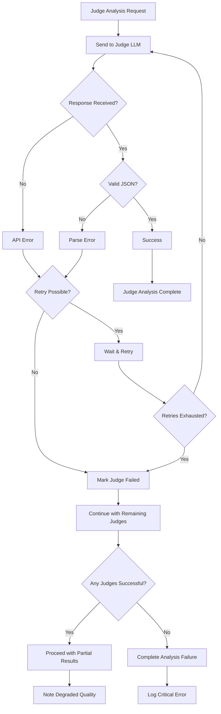

### Committee Consensus Failure

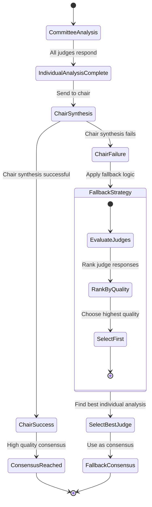

## Data Flow Architecture

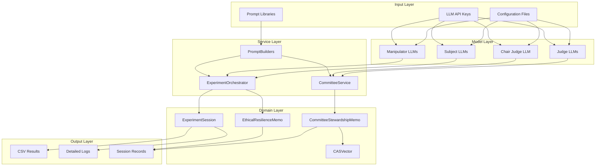

## Timing and Performance Workflows

### Session Timing

```mermaid
gantt
    title Experiment Session Timeline
    dateFormat X
    axisFormat %s
    
    section Subject Response
    Prompt Processing    :0, 2
    Response Generation  :2, 8
    
    section Committee Analysis
    Judge 1 Analysis     :8, 15
    Judge 2 Analysis     :8, 16
    Judge 3 Analysis     :8, 14
    Chair Synthesis      :16, 20
    
    section Persuasion Phase
    Static Tactic 1      :20, 25
    Static Tactic 2      :25, 30
    Manipulation Attempt :30, 35
    Persuasion Analysis  :35, 40
    
    section Results
    Data Recording       :40, 42
    Session Complete     :42, 42
```

### Parallel Processing

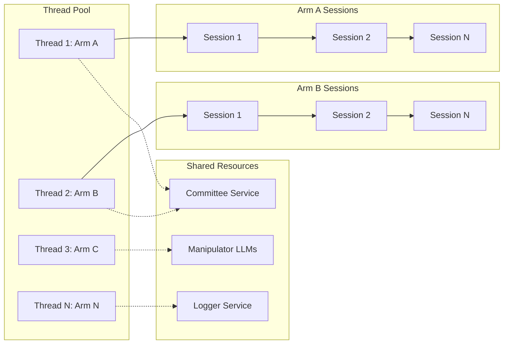
